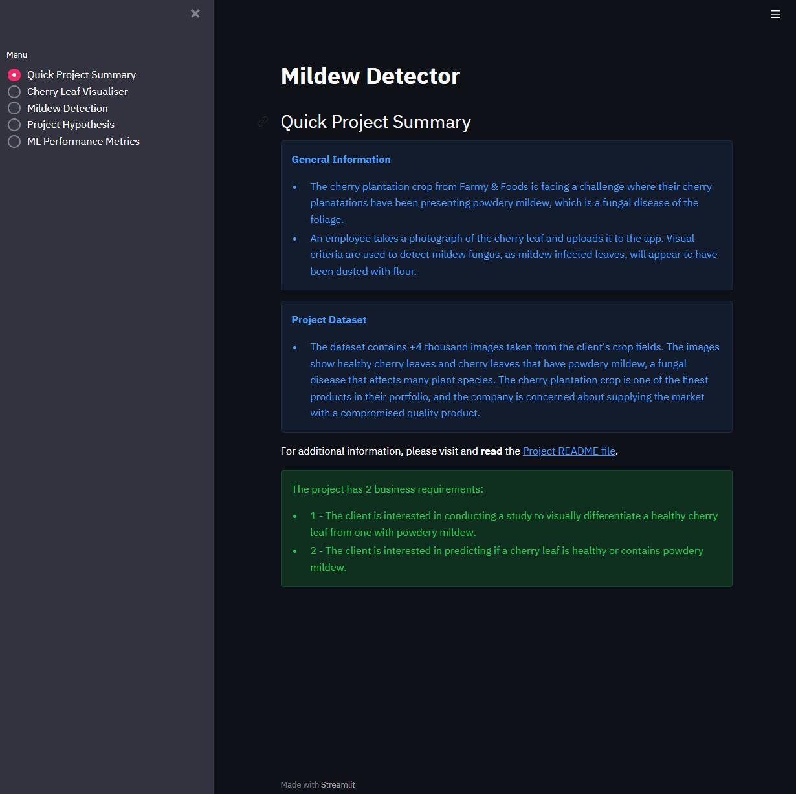
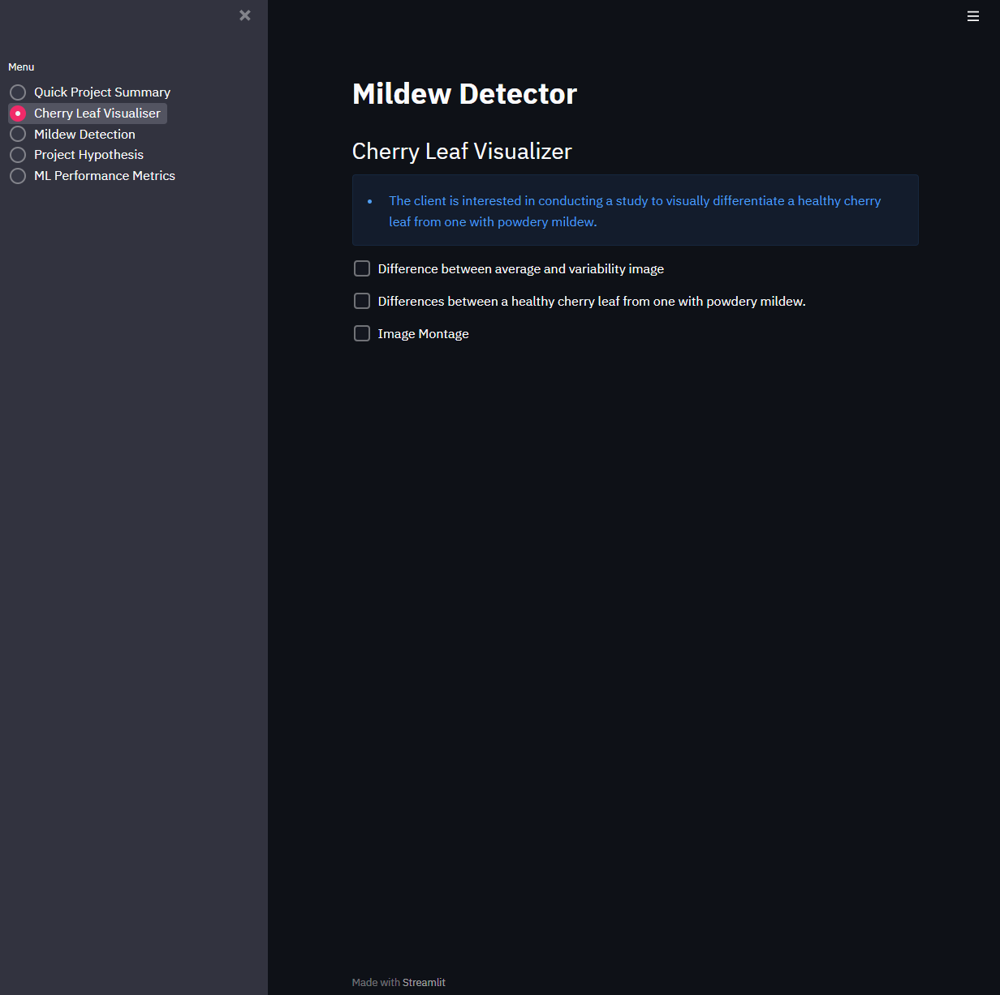
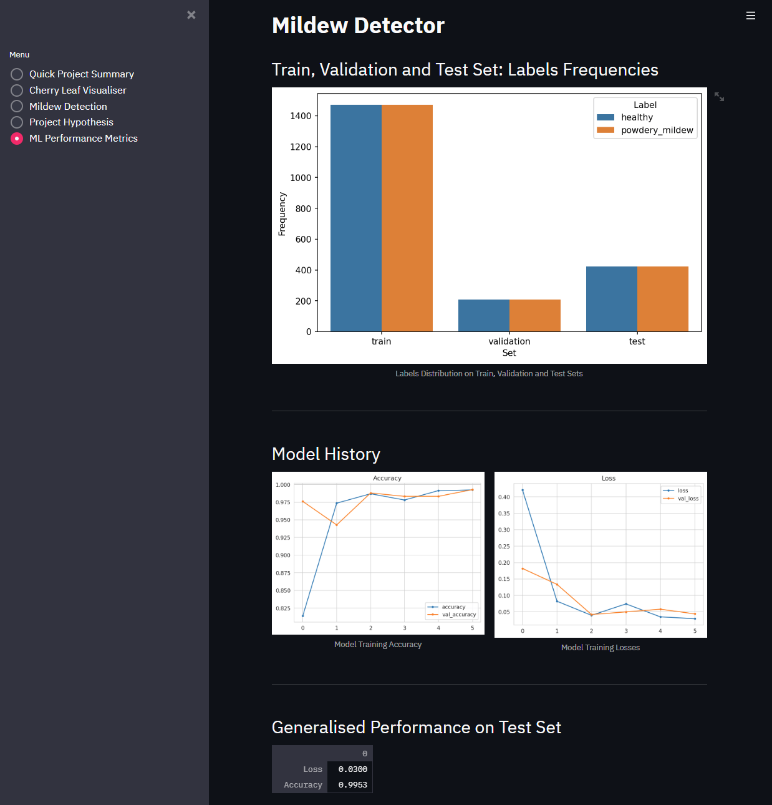

# Mildew Detector

## Dataset Content
* The dataset is sourced from [Kaggle](https://www.kaggle.com/codeinstitute/cherry-leaves). We then created a fictitious user story where predictive analytics can be applied in a real project in the workplace.
* The dataset contains +4 thousand images taken from the client's crop fields. The images show healthy cherry leaves and cherry leaves that have powdery mildew, a fungal disease that affects many plant species. The cherry plantation crop is one of the finest products in their portfolio, and the company is concerned about supplying the market with a compromised quality product.

## Business Requirements
The cherry plantation crop from Farmy & Foods is facing a challenge where their cherry plantations have been presenting powdery mildew. Currently, the process is manual verification if a given cherry tree contains powdery mildew. An employee spends around 30 minutes in each tree, taking a few samples of tree leaves and verifying visually if the leaf tree is healthy or has powdery mildew. If there is powdery mildew, the employee applies a specific compound to kill the fungus. The time spent applying this compound is 1 minute.  The company has thousands of cherry trees, located on multiple farms across the country. As a result, this manual process is not scalable due to the time spent in the manual process inspection.

To save time in this process, the IT team suggested an ML system that detects instantly, using a leaf tree image, if it is healthy or has powdery mildew. A similar manual process is in place for other crops for detecting pests, and if this initiative is successful, there is a realistic chance to replicate this project for all other crops. The dataset is a collection of cherry leaf images provided by Farmy & Foods, taken from their crops.

* 1 - The client is interested in conducting a study to visually differentiate a healthy cherry leaf from one with powdery mildew.
* 2 - The client is interested in predicting if a cherry leaf is healthy or contains powdery mildew.

## Please view the deployed app [here](https://project-portfolio-five.herokuapp.com/).

### What is powdery mildew?

According to [RHS](https://www.rhs.org.uk/disease/powdery-mildews), Powdery mildew is a fungal disease of the foliage, stems and occasionally flowers and fruit where a superficial fungal growth covers the surface of the plant.

Many common edible and ornamental garden plants are affected including apples, blackcurrants, gooseberries, grapes, crucifers, courgettes, marrows, cucumbers, peas, grasses (the powdery mildew fungi are major pathogens of cereal crops), Acanthus, delphiniums, phlox, many ornamentals in the daisy family, Lonicera (honeysuckle), rhododendrons and azaleas, roses and Quercus robur (English oak).

Powdery mildews usually have narrow host ranges comprising of just a few related plants. For example, the powdery mildew affecting peas is a different species from the one attacking apples.

## Hypothesis and how to validate?
* I suspect that leaves affected by powdery mildew will show clear marks/signs. Typically, leaves infected with mildew will have clear powdery patches of fungus, thereby making the leaves appear as if they have been dusted with flour. Whereas healthy leaves will be light green in colour.
* An average image study will help validate this hypothesis.

## The rationale to map the business requirements to the Data Visualisations and ML tasks
#### Business Requirement 1: Data Visualisations
* I want to display the mean and standard deviation images for cherry leaves that are affected by mildew and those that are healthy, so that I can visually differentiate them.
* I want to display the difference between an average infected leaf and an average uninfected leaf.
* I want to display an image montage for either infected, or uninfected leaves.

#### Business Requirement 2: ML Task (Classification)
* I want to predict if a given leaf is infected with mildew or is healthy.
* I want to build an ML model that works as a binary classifier, and generate reports.

## ML Business Case

### MildewClf
* We want an ML model to predict if a leaf shows signs/marks of mildew or not, based on historical image data. It is a supervised model, a 2-class, single-label, classification model.
* Our ideal outcome is to provide the employes of Farmy & Foods a faster and more reliable diagnostic for powdery mildew detection.
* The model success metrics are
	* Accuracy of 99% or more on the test set.
* The model output indicates if the leaf shows powdery mildew or not and the associated probability of being infected or not. The employees will take pictures of cherry leaves and upload the pictures to the App. The prediction is made on the fly (not in batches).
* Heuristics:  Currently, the process is manual verification if a given cherry tree contains powdery mildew. An employee spends around 30 minutes in each tree, taking a few samples of tree leaves and verifying visually if the leaf tree is healthy or has powdery mildew. If there is powdery mildew, the employee applies a specific compound to kill the fungus. The time spent applying this compound is 1 minute. Visual criteria are used to detect mildew fungus. This process is time-consuming and still leaves room for human error. We aim to build a Machine Learning model to save the employess of Farmy & Foods a great amount of time by eliminating the need for manual process inspection. Rather, a picture of the leaf is taken and uploaded to the App and the App distinguishes between infected and uninfected leaves. 
* The training data to fit the model come from the dataset provided by the Code Institute and saved to this [Kaggle dataset directory](https://www.kaggle.com/codeinstitute/cherry-leaves). This dataset contains 4208 images for quicker model training.
	* Train data - target: infected or not; features: all images
	* It is worth noting that when evaluating the average image shape in Jupyter Notebook 02 - Data Visualisation, an unusual scatterplot was produced. As the scatterplot was to display the image shapes and highlight the average/mean image size, it was strange that all plots on the scatterplot were focused in the middle. After further investigation into the provided dataset and printing the image shapes as integers, I found that the dataset images were in fact all the exact same size. This of course is preferrable from the clients perspective, as it allows for faster and more accurate model training and therefore, higher prediction accuracy.

## Agile Methodology and CRISP-DM Workflow

THe agile methodolody and CRISP-DM workflow were used in planning and developing this project.

The CRISP-DM workflow was used to delve deeper into the business requirements of the client and improve our compliance with business understanding. That and the further steps of data understanding and preparation, modelling, evaluation and deployment; were broken down into milestones on Github projects. Issues related to the project development and business requirements were then assigned to fdacilitate the relevant milestone.

Please view the Github projects board [here](https://github.com/users/StephenB92/projects/5/views/1).

## Jupyter Notebook Architecture and Flow

### Three separate Jupyter Notebooks were used for various stages of development

1. Notebook 1 - Data Collection

* The purpose of this notebook is to fetch data from Kaggle and prepare it for further processes. We start by copying our kaggle.json file to the workspace. Then, the required libraries are imported and the working directory is set. This notebook includes a cell that deletes the "cherry-leaves" folder (see "Fixed Bugs" section of the README below). Next, it installs kaggle to download the project dataset. Finally it runs functions to remove non-image files and then, split them into the train, test and validation sets.
* This notebook must be run each time a new workspace is opened, as the dataset is not committed to the project repository as doing so would lead to bloating the repository.

2. Notebook 2 - Data Visualisation

* The purpose of this notebook is to answer business requirement 1: a study to visually differentiate a leaf infected with powdery mildew fungus and a healthy leaf. We start by importing the libraries to manipulate data and create plots. We then set the working, input and output directories, along with the label names. The train, test and validation sets created in the previous notebook are used as the inputs. 
* The notebook then analyses the data to discern the image shape, which is later used in the next notebook for modelling. Next, the notebook performs data visualisation tasks. It calculates the average and variability of images per label, the difference between average mildew fungus infected and average healthy cherry leaf images and finally, creates an image montage. These tasks answer business requirement 1 and are later displayed on the Streamlit dashboard.
* It is not necessary to run this notebook each time a workspace is opened, as our dataset in this project does not change day to day. It is worth noting that, typically in practice, the data collection and visualistion notebooks would be run each time a new workspace is opened. This is because the data you are working with would generally change day to day.

3. Notebook 3 - Modelling and Evaluation

* The purpose of this notebook is to create a machine learning model that will answer business requirement 2: tell whether a given leaf is infected with powdery mildew or not. We start by importing the libraries to manipulate data and create plots. We then set the working, input and output directories, along with the label names. The train, test and validation sets created in the data collection notebook are used as the inputs, along with the image shape created in the data visualisation notebook. 
* First, the notebook calculates and plots the number of images in the train, test and validation data. Next, in order to assist with model training, the notebook performs image data augmentation and plots the results. The class indices are then saved for each dataset. These are used later in the notebook to predict on unseen data.  
* Next, the machine learning model is created. The required packages are imported and the model is created with layers to assist with analysing image data by highlighting distinctive features. We include a dropout layer and early stopping to prevent overfitting. The model is then fitted to the train and validation data and saved. The notebook then evaluates and plots the model's performance and then evaluates it against the test set. These performance metrics are displayed on the Streamlit dashboard.
* Finally, code is written to predict on new data, also using the class indices from earlier. This task answers business requirement 2 and can be used on the Streamlit dashboard also.

## Dashboard Design
#### Page 1: Quick Project Summary
* Quick project summary
	* General Information
		* The cherry plantation crop from Farmy & Foods is facing a challenge where their cherry planatations have been presenting powdery mildew, which is a fungal disease of the foliage.
        * An employee takes a photograph of the cherry leaf and uploads it to the app. Visual criteria are used to detect mildew fungus, as mildew infected leaves, will appear to have been dusted with flour.
	* Project Dataset
        * The dataset contains +4 thousand images taken from the client's crop fields. The images show healthy cherry leaves and cherry leaves that have powdery mildew, a fungal disease that affects many plant species. The cherry plantation crop is one of the finest products in their portfolio, and the company is concerned about supplying the market with a compromised quality product.

	* Link to additional information Readme file.
	
	* Business requirements
		* The client is interested in conducting a study to visually differentiate a healthy cherry leaf from one with powdery mildew.
		* The client is interested in predicting if a cherry leaf is healthy or contains powdery mildew.

#### Page 2: Cherry Leaf Visualizer
* Satisfies business requirement 1 - A study to visually differentiate a healthy cherry leaf from one with powdery mildew

* Checkbox 1 - Difference between average and variability image.

* Checkbox 2 - Differences between average powdery mildew infected and average healthy leaves.

* Checkbox 3 - Image Montage.

#### Page 3: Mildew Detection
* Business requirement two information - "The client is interested in predicting if a cherry leaf is healthy or contains powdery mildew."
* Link to download a set of mildew-infected and healthy leaf images for live prediction.
* Create a user interface with a file uploader widget. The user should upload multiple cherry leaf images. It will display the image and a prediction statement, indicating if the leaf is infected or not with powdery mildew and the probability associated with this statement.
* Table with the image name and prediction results.
* Download button to download table.

#### Page 4: Project Hypothesis and Validation
* I suspect that leaves affected by powdery mildew will show clear marks/signs. Typically, leaves infected with mildew will have clear powdery patches of fungus, thereby making the leaves appear as if they have been dusted with flour. Whereas healthy leaves will be light green in colour.
* Average Image, Variability Image and Difference between Averages studies did not reveal any clear pattern to differentiate one from another."

#### Page 5: ML Prediction Metrics
* Label Frequencies for Train, Validation, and Test Sets
* Model History - Accuracy and Losses
* Model evaluation result

## Fixed Bugs
* At an early stage of this project, the train and test datasets were included in the .gitignore file, however the validation set was not. This resulted in the "cherry-leaves" directory remaining in the workspace also. This was an issue as when the "run all" button is clicked on the Data Collection notebook, the process would stop and an error would be triggered once it reached the cell used to download the dataset. This is because a portion of the data to be downloaded already exists, along with it's directory. As this notebook needs to be run each time a workspace is opened, it is much more user friendly and efficient to just click the "run all" button, rather than each cell individually. Furthermore, as the validation set had already been committed to this projects repository, I was unable to remove it without altering the projects git commit history. Rather than altering the project commit history or requiring the "cherry-leaves" folder to be manually deleted each time the workspace is opened, a solution was created. I added a cell that imports shutil earlier in the notebook and then uses it to delete the "cherry-leaves" directory, before the full dataset is downloaded. Now, when a new workspace is opened and the run all button is clicked in the Data Collection, this notebook automatically runs in it's entirety with no errors.  

## Project Testing

### Dashboard - Manual Testing

1. The project summary page displays information clearly and as intended. The link to the project README file works correctly. See dashboard screenshots above.

2. The cherry leaf visualiser page loads the intended text and interactive checkbox buttons. This page answers business requirement 1. See dashboard screenshots above.

	* Checkbox 1 - Difference between average and variability image. When clicked, the correct plots are displayed on the dashboard, along with the results of the visual analysis. See dashboard screenshots above.

	* Checkbox 2 - Differences between average powdery mildew infected and average healthy leaves. When clicked, the correct plots are displayed on the dashboard, along with the results of the visual analysis. See dashboard screenshots above.

	* Checkbox 3 - Image Montage. When clicked, a dropdown menu and "Create Montage" button appear. The dropdown menu works as intended, as well as the button. Then, the correct plots are displayed on the dashboard. See dashboard screenshots above.

3. The mildew detection page loads the correct layout. The dataset download link works as intended. The user file uploader successfully loads .jpg and .png files and the correct predictions and reports are displaying as intended. The download report folder also works as intended and provides the user with a csv file report on the predictions. This page answers business requirement 1. See dashboard screenshots above.

4. The project hypothesis and validation page displays information clearly and as intended. See dashboard screenshots above.

5. The performance metrics page loads correctly. The page displays the relevant label frequency, model history and performance on test set metrics and demonstrate the classification models performance. See dashboard screenshots above.

### Jupyter Notebooks

* All three project notebooks run smoothly, produce expected results/outputs. No errors are returned.

### Python Testing

* All python files in the app_pages and src folders have been tested using the Code Institutes Python Linter (credit below). Each file passed with no major errors.

## Deployment - Heroku

* The App live link is [here](https://project-portfolio-five.herokuapp.com/)
* The project was deployed to Heroku via the Command Line Interface using the following steps.

#### On Heroku site
1. Login to Heroku account.
2. Click on the "Open App" button on the top right-hand side of the page and select "Create new app".
3. Enter the name of your app.
4. Choose your region. 
5. Click "Create app".

#### Prepare the relevant deployment files
1. Prepare the Procfile and add the following: 
* web: sh setup.sh && streamlit run app.py.
2. Prepare the setup.sh file and add the following:
* mkdir -p ~/.streamlit/
	echo "\
	[server]\n\
	headless = true\n\
	port = $PORT\n\
	enableCORS = false\n\
	\n\
	" > ~/.streamlit/config.toml
3. Create requirements.txt file

#### In the Command Line Interface
1. Login to heroku and enter your credentials.
* command: heroku login -i
2. Get your app name from heroku.
* command: heroku apps
3. Set the heroku remote. (Replace <app_name> with your actual app name)
* command: heroku git:remote -a <app_name>
4. Add, commit and push to github
* command: git add . && git commit -m "Deploy to Heroku via CLI"
5. Push to both github and heroku
* command: git push origin main
* command: git push heroku main
6. The deployment process should happen smoothly if all deployment files are fully functional. Click now the button Open App on the top of your Heroku app page to access your App.

## Main Data Analysis and Machine Learning Libraries
* Numpy is used to handle multi-dimensional arrays and includes a wide set of mathematical functions to work with these arrays.
* Kaggle is used in conjunction with the kaggle.json file to download the project dataset.
* Zipfile is used to extract the dataset image files from the file downloaded from Kaggle.
* Shutil is used to split the dataset images into the train, test and validation directories at the specified ratios.
* Streamlit is used to create and customise the project dashboard.
* Joblib is used to save ML prediction metrics and data visualisation plots.
* Pandas is used for analysing the collected dataset, including performing statstical analysis.
* Matplotlib is used for data visualisation and creating plots in jupyter notebooks.
* Seaborn provides a high-level interface for statstical graphics and it offers a built-in themes for styling Matplot graphics.
* Plotly is used for plotting data and functions, add interactivity and animation to data visualisation.
* Scikit-learn provides tools for machine learning and is used for statistical modeling including classification and clustering.
* Tensorflow is used for data automation, model tracking, performance monitoring, and model retraining. Used to reduce the error in every iteration while fitting the model by using a built-in optimiser and loss function.
* Keras is a high-level, deep learning API developed by Google for implementing neural networks.
* Itertools used to iterate over data structures using a for-loop.
* Random is used to generate random numbers.

## Credits 
* Credit to Code Institute's [Malaria Detector Walkthrough Project](https://learn.codeinstitute.net/courses/course-v1:code_institute+CI_DA_ML+2021_Q4/courseware/07a3964f7a72407ea3e073542a2955bd/29ae4b4c67ed45a8a97bb9f4dcfa714b/), which was used as a guide and template during development of this project.
* Credit to the [Pandas Documentation](https://pandas.pydata.org/docs/).
* Credit to the [Matplotib Documentation](https://matplotlib.org/stable/index.html).
* Credit to the [Scikit-learn Documentation](https://scikit-learn.org/stable/).
* Credit to the [Seaborn Documentation](https://seaborn.pydata.org/).
* Credit to the [Tensorflow Documentation](https://www.tensorflow.org/?gclid=Cj0KCQiA14WdBhD8ARIsANao07jdpeMhBonZ05pNyzY8lp73O_ZirE4Ehlz_Qlhm-qeg1kbPabqLFmYaApokEALw_wcB).
* Credit to the [Keras Documentation](https://keras.io/).
* Credit to the [Streamlit Documentation](https://docs.streamlit.io/).
* Credit to the [Code Institute Python Linter](https://pep8ci.herokuapp.com/#), which was used for python code validation.

### Content 
* Credit to [RHS](https://www.rhs.org.uk/disease/powdery-mildews) and [Almanac](https://www.almanac.com/pest/powdery-mildew) for information on powdery mildew and how to identify it.

### Media
* Credit to the cherry leaf image dataset provided by the Code Institute and saved to this [Kaggle dataset directory](https://www.kaggle.com/codeinstitute/cherry-leaves). 

## Acknowledgements
* My mentor Rohit Sharma for continuous helpful feedback.
* Tutor support and student care at Code Institute for their support.
* The Code Institute Slack community for their support.

